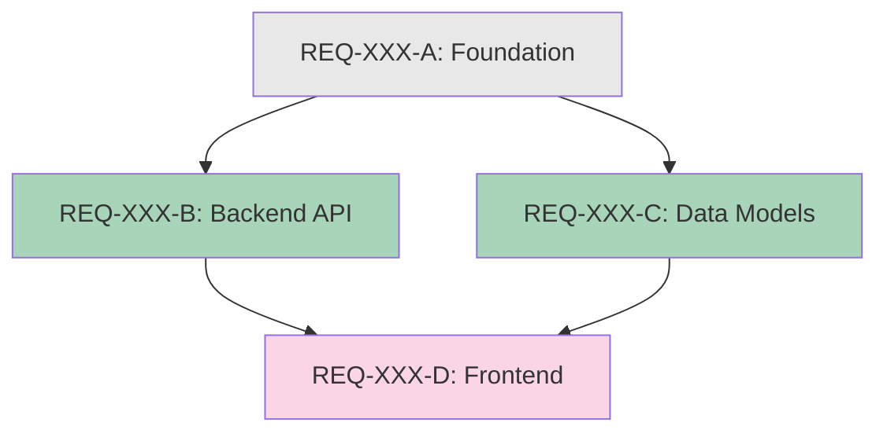
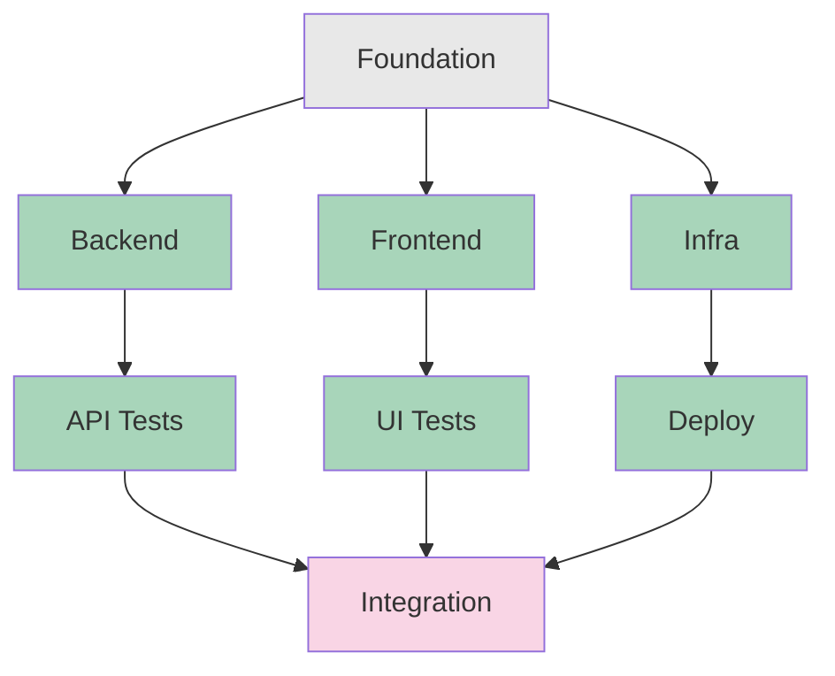

# DAG Visualization Patterns

Reference guide for creating dependency visualizations in task decomposition.

## ASCII DAG Formats

Use ASCII art for simple dependency visualization.

### Linear Chain

```
A -> B -> C -> D
```

**When to use:** Sequential dependencies with no parallelization opportunities.

---

### Diamond Pattern (Parallel Middle)

```
      A
     / \
    B   C
     \ /
      D
```

**When to use:** Foundation task (A) enables parallel work (B, C), which converge into final integration (D).

**Roadmap translation:**
- `REQ-XXX-B: Blocked by: REQ-XXX-A`
- `REQ-XXX-C: Blocked by: REQ-XXX-A`
- `REQ-XXX-D: Blocked by: REQ-XXX-B, REQ-XXX-C`

---

### Fan-Out Pattern

```
      A
    / | \
   B  C  D
```

**When to use:** Foundation task (A) enables multiple independent parallel tasks.

**Roadmap translation:**
- `REQ-XXX-B: Blocked by: REQ-XXX-A`
- `REQ-XXX-C: Blocked by: REQ-XXX-A`
- `REQ-XXX-D: Blocked by: REQ-XXX-A`
- All B, C, D can run in parallel

---

### Fan-In Pattern

```
   A  B  C
    \ | /
      D
```

**When to use:** Multiple independent foundation tasks (A, B, C) converge into final integration (D).

**Roadmap translation:**
- `REQ-XXX-A: Blocked by: None`
- `REQ-XXX-B: Blocked by: None`
- `REQ-XXX-C: Blocked by: None`
- `REQ-XXX-D: Blocked by: REQ-XXX-A, REQ-XXX-B, REQ-XXX-C`
- All A, B, C can run in parallel

---

### Complex DAG

```
         A
        / \
       B   C
      /|   |\
     D E   F G
      \|   |/
       H   I
        \ /
         J
```

**When to use:** Multi-layer decomposition with complex dependencies.

**Roadmap translation:**
- Phase 1: A (sequential)
- Phase 2: B || C (parallel)
- Phase 3: D || E || F || G (parallel)
- Phase 4: H || I (parallel)
- Phase 5: J (final integration)

---

## Mermaid DAG Format

For more complex dependencies or when rendering visual diagrams.

### Basic Mermaid Syntax



**Color Coding:**
- Gray (`#e8e8e8`): Sequential/blocking tasks
- Green (`#a8d5ba`): Parallelizable tasks
- Pink (`#f9d5e5`): Final integration tasks

---

### Complex Mermaid Example



---

## Dependency Matrix

For many items (>5 requirements), use a matrix for clarity.

### Matrix Format

```markdown
## Dependency Matrix

|          | A | B | C | D | E |
|----------|---|---|---|---|---|
| A        | - |   |   |   |   |
| B        | X | - |   |   |   |
| C        | X |   | - |   |   |
| D        |   | X | X | - |   |
| E        |   |   |   | X | - |

X = row depends on column
```

**Reading the matrix:**
- Row B, Column A has X: B depends on A
- Row C, Column A has X: C depends on A
- Row D, Columns B and C have X: D depends on both B and C
- Row E, Column D has X: E depends on D

**Parallelization detection:**
- Rows with same dependencies can run in parallel
- Example: B and C both only depend on A → parallel

---

## Choosing the Right Format

| Scenario | Best Format | Why |
|----------|-------------|-----|
| 2-4 requirements, simple | ASCII (Linear/Diamond) | Quick to create, easy to read |
| 5-8 requirements, moderate | ASCII (Complex) or Mermaid | Visual clarity with color coding |
| 8+ requirements | Dependency Matrix | Clearest for large sets |
| Documentation/presentations | Mermaid | Renders as visual diagram |
| Roadmap planning | ASCII + Matrix | Both quick reference and detail |

---

## Examples by Decomposition Strategy

### Layer Split (Backend -> Frontend)

```
    Data Model
        |
    Backend API
        |
    Frontend UI
        |
    E2E Tests
```

**Parallelization:** None (sequential layers)

---

### Domain Split (Parallel Modules)

```
      Foundation
     /     |     \
   Auth  Users  Settings
     \     |     /
     Integration
```

**Parallelization:** Auth, Users, Settings run in parallel after Foundation

---

### Feature Slice (CRUD Operations)

```
     Core Model
    /    |    \
Create  Read  Update
    \    |    /
    E2E Tests
```

**Parallelization:** Create, Read, Update run in parallel after Core Model
